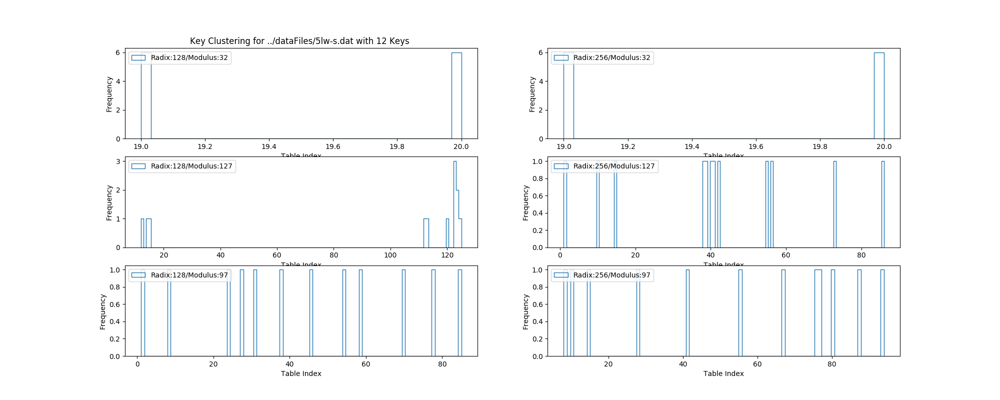
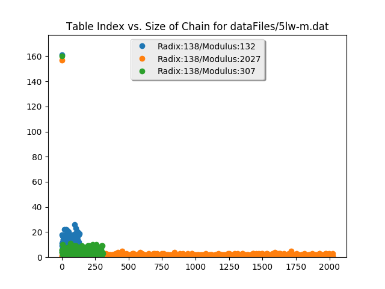
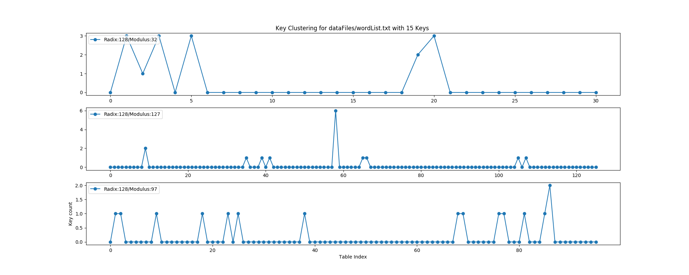

# python_hash_analysis

### Purpose
This repository is used to demonstrate the effectiveness of various hash table and radix values in relation to size of dataset.

### Datasets
The files located within the datafile folder include a datasets of unique five letter words (5lw). 
Using sets of unique keys will be able to test the effectiveness each modulus-radix value pairings based on 
size of dataset.
#### Uniform Length
The wordlist.txt dataset contains a set of random length words. This will effect the number of values that hash to the same 
value. It is easy to see that if for every string of the same length, the value ABCD = N and DCBA = M if the hashed 
according to Horner's Rule as A*c^3 + B*c^2 + C*c^1 + D. 
However, for the strings ABCD = N and XYZ = M it is possible for M = N.   

### Uniqueness and Randomization
The uniqueness of the dataset is important in measuring the efficiency of the hash value. 
Using a randomized set will prevent us from counting the number of unique keys that map to the same hash value. 
Randomization will generate repetitions of keys, which will artificially increase the number of keys that are mapped to
the same hash value. For instance, if the string AABB was randomly generated 10 times and was mapped to the hash value 18. 
If another string EEGE was mapped to 18 it is more useful to show that the hashing function created 1 repeat to the hash 
value 18, rather than seeing it was mapped to 11 times since ten of those mappings are a repeat in the key value.

### Visualization
The plot generated helps visualize the clustering that occurs from the varying radix-modulus pairings on the same dataset.  
The y-axis is the number of collisions while the x-axis is the index within the table.
Each point is an index-collision pairing. The points can also be thought of as each
length of the chain at each index.

#### Figure A
	The varying effeciency for the radices 128 and 256 and the moduli values (32, 127, 97) can be seen in the plot below.
	Considering the first radix 128:
	The first plot shows the clustering of the modulus value 32. 
		The first 6 words are mapped to 19 and the remaining 6 are mapped to 20.
		This is very inefficient because the cluster count is only 2 and each cluster size is 6.
	The second plot shows the clustering of the modulus value 127.
		Note how there are fewer clusters each of greater or equal size than the clusters in the third plot.
		The number of keys hashed to the same value was less than modulus 32
	The third plot shows the clustering of the modulus value 97.
		Notice how the amount of clusters is equal to the amount of keys. This is very efficient because 
		each unique key is mapped to a unique index.
	One would imagine that based on intuition that increasing the modulus size will improve effieciency 
	and decrease the amount of collisions. However the middle plot acts as counter evidence.

###### Figure B 

###### Figure C

