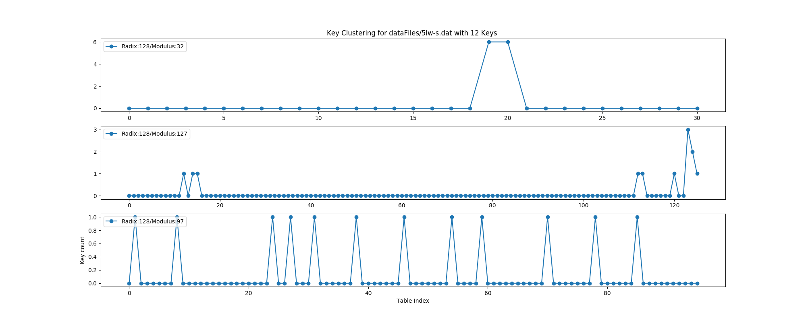

# python_hash_analysis

This repository is used to demonstrate the effectiveness of various hash table and radix values in relation to size of dataset.

Within the datafile folder, 5lw-s.dat is a list of 128 unique 5 letter strings.
Considering Figure A, the x-axis represebts the index from within the table. The y-axis is used to show the number of collisions that occured at that index. The modulus value modifies the table size by restricting the indices from 0,.., modulus. The plot below has 3 varying modulus values for the 5lw-s dataset. Note that the plots x-axis is ranged from 0 to the largest modulus given.

