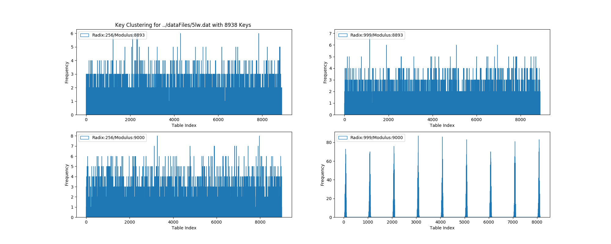

# python_hash_analysis

### Purpose
This repository is used to demonstrate the effectiveness of various hash table and radix values in relation to size of dataset.

### Datasets
The files located within the datafile folder include a datasets of unique five letter words (5lw). 
Using sets of unique keys will be able to test the effectiveness each modulus-radix value pairings based on 
size of dataset.
#### Uniform Length
The wordlist.txt dataset contains a set of random length words. This will effect the number of values that hash to the same 
value. It is easy to see that if for every string of the same length, the value ABCD = N and DCBA = M if the hashed 
according to Horner's Rule as A*c^3 + B*c^2 + C*c^1 + D. 
However, for the strings ABCD = N and XYZ = M it is possible for M = N.   

### Uniqueness and Randomization
The uniqueness of the dataset is important in measuring the efficiency of the hash value. 
Using a randomized set will prevent us from counting the number of unique keys that map to the same hash value. 
Randomization will generate repetitions of keys, which will artificially increase the number of keys that are mapped to
the same hash value. For instance, if the string AABB was randomly generated 10 times and was mapped to the hash value 18. 
If another string EEGE was mapped to 18 it is more useful to show that the hashing function created 1 repeat to the hash 
value 18, rather than seeing it was mapped to 11 times since ten of those mappings are a repeat in the key value.

### Visualization
The plot generated helps visualize the clustering that occurs from the varying radix-modulus pairings on the same dataset.  
The y-axis is the number of collisions while the x-axis is the index within the table.
Each point is an index-collision pairing. The points can also be thought of as each
length of the chain at each index.

#### Figure A
	The varying efficiency for the radices 128 and 256 and the moduli values (32, 127, 97) can be seen in the plot below.
	Considering the first radix 128 in the left column:
	The first plot shows the clustering of the modulus value 32. 
		The first 6 words are mapped to 19 and the remaining 6 are mapped to 20.
		This is very inefficient because the cluster count is only 2 and each cluster size is 6.
	The second plot shows the clustering of the modulus value 127.
		Note how there are fewer clusters each of greater or equal size than the clusters in the third plot.
		The number of keys hashed to the same value was less than modulus 32
	The third plot shows the clustering of the modulus value 97.
		Notice how the amount of clusters is equal to the amount of keys. This is very efficient because
		each unique key is mapped to a unique index.
	Considering the second radix 256 in the right column:
	The first plot provided the exact same results as its radix 128 counterpart, so choosing a different radix provided
	    no benefit or loss of efficiency in this case.
	The second plot does better than its radix 128 counterpart and ended up having no collisions.
	The third plot did just as good as its radix 128 counterpart and ended up having no collisions as well.
	One would imagine that based on intuition that increasing the modulus size will improve efficiency
	and decrease the amount of collisions, however, the middle plot acts as counter evidence to that point.
	Selecting a larger radix in these plots only improved efficiency in the second scenario by eliminating all collisions
	and provided no improvement in the other two scenarios where collisions were the same. A more in depth analysis of radix
	selection will be provided in the following section.

#### Importance of Radix and Modulus Choice
Each character string of length n can be thought of as an n-1 degree polynomial, and by using Horner's rule it is easy to see how a hash value can be generated. So, for strings that end in similar polynomial sequences will often be mapped to the same value if the modulus and radix pair is not chosen wisely. 
This can be seen in the following plot. 
The left column demonstrates the clustering seen from choosing a radix that is a prime number.
The modulus value 9000 was chosen because it is only slightly larger than the key set size of 8938 . Note that it is not prime
However, when choosing the prime 8893 one can assume that there must be some collisions since the table size is smaller than the key size, which is true. Yet, because this number is a prime this allowed for that hash values to be more evenly distributed among the table than the non-prime 9000. This can be seen by looking at the number of collisions that occurred at each index. And for the value 8893, although it is less than the table size performed slighlty better by having collision heights of 6 as compared to 8. This is a minor difference but it can be used to illustrate the importance of prime modulo values.

In the same figure, the importance of choosing a correct radix can be seen. Radices that are prime, or multiples of 2 are considered good 
choices. So to illustrate this the right column tests the same modulus values as before but uses 999 because it is a nonprime divisible 
by 3. As you can see from the top plot, this did not seem to affect the clustering too much, but it still performed slightly worse than 
using the radix 256. But, in the graph below, when choosing the non-prime modulus 9000, the affect the radix has on the clustering can be 
seen.

